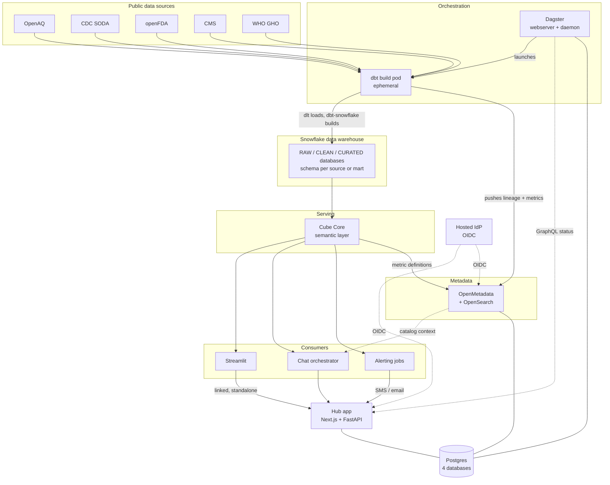
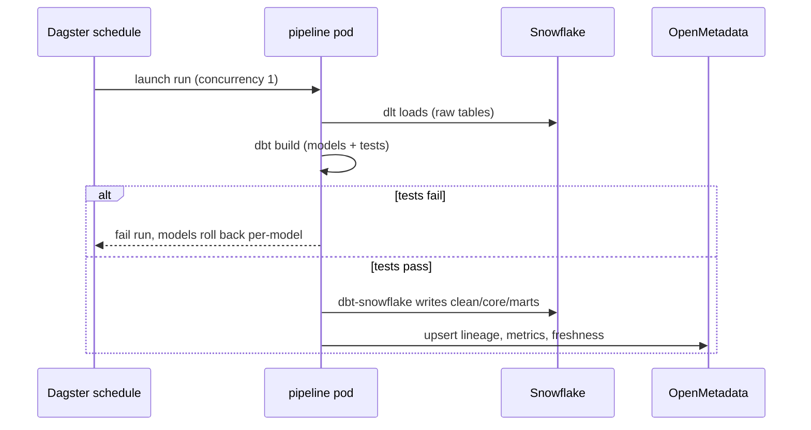
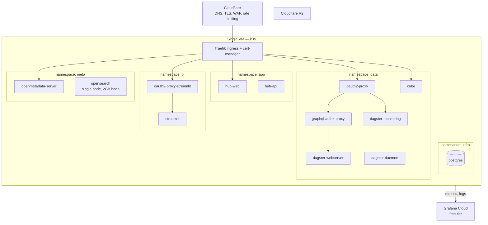

# Open Health Data Platform — Architecture

A self-hosted SaaS platform over public health data. Free and paid ($5/mo) tiers.
Every platform component is intentionally user-visible: this is a portfolio project as
much as a product.

**Audience for this document:** the implementing agent. It defines target
architecture, repo layout, and build order. It is not a tutorial.

---

## 1. Design principles

These drive most decisions below. Read them before changing anything.

1. **The data is public and identical for every user.** There is no PHI, no
   per-tenant data, no HIPAA exposure. Authorization is about *features and
   quotas*, not rows. Do not build row-level security on the health data.
2. **Materialize once, serve many.** Compute cost scales with query volume, not
   user count. Everything is precomputed by a batch pipeline and served read-only.
3. **Cost ceiling is ~$35/month of infrastructure.** One VM, one Postgres, free
   tiers everywhere else. Any design that requires managed Kubernetes, a cloud
   warehouse, or a second always-on database is out of budget.
4. **Low availability is acceptable.** Single replica, brief downtime during
   rollouts and upgrades is fine. Do not add HA complexity.
5. **One metric definition, three consumers.** Dashboards, chatbot, and alerting
   all read from the semantic layer. They must never disagree about what a number means.
6. **The agent never writes raw SQL against tables.** It selects from a bounded
   set of measures and dimensions. This is the primary safety control.

---

## 2. System architecture



### What each component owns

| Component | Responsibility | Notes |
|---|---|---|
| Hub app | Signup, billing, chat UI, links to every tool (including Streamlit) | The only thing most users see first |
| Dagster | Ingestion, dbt orchestration, ML inference, alert checks | Publicly visible, hardened (§5) |
| dbt | SQL transformation and tests | Snowflake only (ADR-0014) |
| Snowflake | Compute and storage for the medallion warehouse | dlt loads, dbt-snowflake builds |
| Cube Core | Semantic layer: measures, dimensions, access control, MCP endpoint | Single definition of every metric, queries Snowflake directly |
| Streamlit | Dashboards, standalone (linked from the hub app, not embedded) | Direct Snowflake for now (M1); repoint at Cube once M2 lands |
| OpenMetadata | Catalog, lineage, glossary, metric directory, discovery MCP | Human-browsable surface |
| Postgres | App metadata for Dagster, OpenMetadata, hub app | One instance, three databases |
| Spaces | Postgres backups | S3-compatible, zero egress fees |

---

## 3. Data lifecycle

The core pattern (ADR-0012). dlt and dbt-snowflake write straight to Snowflake;
there is no separate publish/replicate step, and no snapshot file to keep two
processes from sharing.



**Do not merge/build on failed tests.** The dbt test gate is the only thing
standing between a broken upstream API and a wrong number on a clinician's
dashboard.

---

## 4. Deployment topology

Single VM. Hetzner **CX52** (16 vCPU, 32 GB, 320 GB NVMe), k3s, Germany or Finland.
Provisioned by `platform/terraform`; workloads deployed with Helm.

> Corrected 2026-09-09: earlier drafts said "CX53", which is not a Hetzner server
> type. The specs and price quoted were those of the CX52. Note CX52 is EU-only —
> a US region needs `cpx51` (AMD, 16 vCPU / 32 GB / 360 GB).

Do not use EKS or GKE. Note the reason is *compute* cost, not control-plane cost:
some providers (Vultr VKE among them) give the control plane away free, but their
compute runs ~4-5x Hetzner's for the same RAM. See [ADR-0005](decisions/0005-hetzner-k3s-over-managed-kubernetes.md).



> `cube` (D6) is reached directly through ingress, not behind oauth2-proxy —
> unlike Dagster and Streamlit, its authn/authz is Cube's own JWT security
> context (§5: "Service token from hub-api"), so a browser SSO wall in front
> of it would be redundant, not additive.
>
> **DNS / edge, as built.** One DigitalOcean load balancer fronts everything
> (Traefik `Service type: LoadBalancer`); Ingresses route by hostname. Public
> hosts are `app`, `dagster`, `catalog`, `cube`, `streamlit` under
> `open-health-data-platform.org`. `open-health-data-platform.org` is a Cloudflare zone; the records
> are managed by Terraform (`platform/terraform/dns.tf`, `cloudflare` provider)
> but are **DNS-only** — Cloudflare is not in the request path, so TLS is Let's
> Encrypt at the origin (cert-manager, HTTP-01) and there is no edge WAF or rate
> limiting yet. The "rate limit at
> Cloudflare" and edge-TLS notes below are the target, not the current state;
> reaching them means switching the records to proxied and moving cert-manager
> to a DNS-01 solver or a Cloudflare Origin CA cert.

### Resource budget

Steady state ~13 GB, burst ~15 GB during a build.

| Workload | Memory request | Notes |
|---|---|---|
| opensearch | 3 GB | Largest single consumer; single node, 1 shard, 0 replicas |
| openmetadata-server | 2 GB | JVM |
| streamlit | 0.5 GB | Single process, no operator, no metastore (ADR-0015) |
| postgres | 1 GB | 3 databases: dagster, openmetadata, app |
| dagster-webserver + daemon | 1 GB | |
| cube | 0.5 GB | No Cube Store, no pre-aggregations initially; queries Snowflake directly |
| hub-web + hub-api | 0.5 GB | |
| ingress, cert-manager, oauth2-proxy, graphql-proxy | 0.3 GB | |
| k3s system | 1 GB | |
| pipeline pod | 1.5 GB | Burst only, concurrency capped at 1; compute is Snowflake, not this pod |

Set memory **limits** on every pod. An unbounded in-pod query (opensearch,
cube, ...) will otherwise take down the node.

### Cost

| Item | Monthly |
|---|---|
| Hetzner CX52 + IPv4 | ~$35 (EUR 32.40 + IPv4) |
| R2 (10 GB free tier), Cloudflare, hosted IdP, Grafana Cloud, Resend | $0 |
| Domain amortized | ~$1 |
| LLM inference | Variable — quota-gated |

---

## 5. Auth and authorization

One hosted OIDC provider (Clerk, Auth0, or WorkOS free tier). Self-hosted Keycloak
was considered and rejected: ~1 GB of RAM for no user-visible benefit at this scale.

Tokens carry a `tier` claim (`free` | `paid`).

| Surface | Authn | Authz |
|---|---|---|
| Hub app | OIDC session | Entitlement checks in hub-api against `tier` |
| Streamlit | oauth2-proxy Google wall, `kgmcquate@gmail.com` only | No role mapping — one operator, not a multi-tenant surface |
| OpenMetadata | Native OIDC | Default viewer role for all authenticated users |
| Dagster | oauth2-proxy gates the hostname | GraphQL allowlist proxy enforces read-only |
| dagster-monitoring | oauth2-proxy gates the hostname (same wall as Dagster, path-routed) | Reads Dagster GraphQL through graphql-authz-proxy, not the raw webserver |

As deployed today (M1), Streamlit sits behind its own oauth2-proxy Google wall
restricted to `kgmcquate@gmail.com` (`platform/helm/values/oauth2-proxy-streamlit.yaml`)
— it is an internal analytics tool with one operator, not a public or
multi-tenant surface. Unlike Superset, Streamlit has no login system of its
own; this wall is the only authn/authz it gets (ADR-0015). It also has no
guest-token embed story, so it is linked from the hub app as a standalone
destination rather than embedded in it.
| Cube | Service token from hub-api | `queryRewrite` applies tier limits |

### Dagster hardening — non-negotiable

Dagster is publicly exposed. Its own read-only mode is a UI-level concern only;
the GraphQL proxy is what actually enforces it.

Implemented with [`kgmcquate/graphql-authz-proxy`](https://github.com/kgmcquate/graphql-authz-proxy),
deployed from `platform/helm/charts/graphql-authz-proxy` — policy is config, not
code ([ADR-0006](decisions/0006-upstream-charts-and-external-authz-proxy.md),
which also records two upstream defects to fix before this goes public).

- **Allowlist, not denylist.** Permit read operations (`runsOrError`, `assetNodes`,
  `assetsLatestInfo`, `pipelineRunsOrError`, `instigationStatesOrError`) and reject
  everything else by default. A denylist silently opens up on every Dagster upgrade.
- **Scrub logs.** Run logs are world-readable. Add a redaction filter to the logging
  config. No secrets in tracebacks, no connection strings in dbt output.
- **No secrets in run config or tags.** These render in the UI. Reference Kubernetes
  secrets by env var name only.
- **Curate asset metadata.** Row counts are fine; sample rows and file paths are not.
- **Rate limit at Cloudflare.** The Dagster UI polls GraphQL continuously; a few
  hundred idle viewers generate real load on the daemon and Postgres.

---

## 6. Chatbot safety model

The agent has two MCP connections and no direct database access:

- **OpenMetadata MCP** (`{OM_URL}/mcp`) for discovery: what exists, who owns it,
  is it fresh, what does this term mean.
- **Cube MCP** for execution: select measures and dimensions from the semantic model.

Controls:

- No raw SQL tool is exposed to the agent. Ever.
- Hard row limit and statement timeout on every generated query.
- Monthly query quota per tier, enforced in hub-api before the agent is invoked.
- Generated query and result shape are always shown to the user. Clinicians will not
  trust an unattributed number, and they shouldn't.
- Every question, plan, and result logged to Postgres to build an eval set.

**Serving-side worker pool.** Route every query through a bounded pool. Cap concurrent
queries and their summed memory expectation; queue or reject excess rather than letting
each request start a full scan. Record queue wait, duration, peak memory, spill bytes,
input bytes, and output rows. This is both the OOM guard and the observability story.

### Ticket creation

Chatbot requests for new data sources or metrics open GitHub Projects issues.
Before creating: embed the request, similarity-search open issues, and upvote a
duplicate rather than filing a new one. Rate limit per user per month. Label by tier.

---

## 7. Monorepo layout

```
health-data-platform/
├── apps/
│   ├── web/                    # Next.js hub: landing, chat UI, links out to Streamlit
│   ├── api/                    # FastAPI: chat orchestration, entitlements, Stripe webhooks
│   └── streamlit/              # Streamlit dashboards — direct Snowflake queries
│
├── data/
│   ├── src/                    # src layout — dir names are import names (ADR-0004)
│   │   ├── ohdp_ingestion/     # One module per source; typed clients, schema contracts
│   │   │   ├── openaq/
│   │   │   ├── cdc/
│   │   │   ├── openfda/
│   │   │   ├── cms/
│   │   │   └── who/
│   │   ├── ohdp_orchestration/ # imported as ohdp_orchestration, not dagster
│   │   │   ├── definitions.py  # Single Definitions object
│   │   │   ├── assets/         # Grouped by domain
│   │   │   ├── jobs/
│   │   │   ├── schedules/
│   │   │   ├── sensors/
│   │   │   └── resources/      # R2, dlt/dbt Snowflake, Cube, OpenMetadata, k8s clients
│   │   └── ohdp_ml/
│   │       ├── anomaly/        # EARS C1-C3, Farrington, STL + robust z-score
│   │       ├── forecast/       # FluSight-style quantile forecasts, WIS scoring
│   │       └── eval/           # Baselines must beat naive before shipping
│   └── dbt/
│       ├── models/
│       │   ├── staging/
│       │   ├── intermediate/
│       │   └── marts/
│       ├── tests/
│       └── dbt_project.yml
│
├── semantic/
│   └── cube/
│       ├── model/              # Cubes: measures, dimensions, joins
│       └── cube.js             # queryRewrite for tier limits
│
├── catalog/
│   └── openmetadata/
│       ├── sync/               # Cube meta -> Metric entities; dbt -> lineage
│       └── seed/               # Glossary terms, domains, custom properties
│
├── platform/
│   ├── terraform/              # Hetzner VM + firewall, Cloudflare DNS + R2, k3s via cloud-init
│   ├── helm/
│   │   ├── charts/hub-api/                # our chart — FastAPI backend
│   │   ├── charts/graphql-authz-proxy/    # our chart — wraps kgmcquate/graphql-authz-proxy
│   │   └── values/             # values for upstream dagster/openmetadata/opensearch charts
│   ├── k3s/
│   │   └── base/               # Namespaces, ingress, cert-manager
│   └── scripts/                # Bootstrap, backup, restore
│
├── packages/
│   └── shared/                 # Shared Python config, types, logging with redaction
│
├── docs/
│   ├── ARCHITECTURE.md         # This file
│   ├── decisions/              # ADRs — see §9
│   └── runbook.md
│
└── .github/workflows/          # CI: lint, dbt parse, image build, deploy
```

Rationale for a monorepo: dbt models, Cube definitions, and OpenMetadata sync must
change together or metrics drift. A single PR that touches all three is the point.

---

## 8. Build order

Each milestone should be independently demoable. Do not start the next until the
previous is green for a week.

**M0 — Pipeline spine**
Two sources (OpenAQ, one CDC surveillance dataset). dbt against Snowflake
(ADR-0012, later made the only target by ADR-0014). Dagster running the build.
No auth, no UI, no catalog. Goal: prove dlt loads + dbt-snowflake builds stay
green.

**M1 — Platform on k3s**
Provision the VM, k3s, Postgres, ingress, TLS. Deploy Dagster with oauth2-proxy and
the GraphQL allowlist proxy. Deploy Streamlit pointed at Snowflake (directly, or via
Cube once M2 lands). Everything public, still free, still no chatbot.

**M2 — Semantic layer and catalog**
Cube Core with the first five metrics. Repoint Streamlit at Cube. Deploy OpenMetadata
and the sync job so metrics and lineage appear in the catalog. Hub app shell with OIDC
and a link out to Streamlit.

**M3 — Chatbot**
Read-only Q&A over Cube MCP plus OpenMetadata MCP. Log everything. Quota enforcement.
No dashboard creation, no ticket creation yet.

**M4 — Monetization**
Stripe, tier claims, quota tiers. Alerting via email. Dashboard generation from a
validated chart spec. GitHub ticket flow with dedup.

**M5 — ML**
Classical anomaly detection baselines first (EARS, Farrington), then compare an ML
approach against them. LLM writes the explanation; it never does the detection.
Forecasting scored against a naive baseline with WIS.

---

## 9. Constraints for the implementer

Things that will look like reasonable improvements and are not:

- **Do not move to a more expensive host for managed Kubernetes.** The original
  wording here ("the control plane cost exceeds the total budget") was wrong:
  free managed control planes exist. The binding constraint is compute price per
  GB of RAM, where Hetzner is ~4-5x cheaper than the managed-k8s providers.
  [ADR-0005](decisions/0005-hetzner-k3s-over-managed-kubernetes.md) has the numbers.
- **DuckDB's Quack client-server protocol is moot for serving.** It would have
  solved DuckDB's single-writer constraint for the publish-and-replicate path,
  which ADR-0012 retired — serving reads Snowflake (directly, or via Cube)
  instead.
- **Do not use the dbt Semantic Layer's serving APIs.** They require dbt Cloud at
  roughly $100/user/month. MetricFlow itself is open source; the serving tier is not.
- **Do not give the agent a raw SQL tool** on the grounds that it would be more flexible.
- **Do not split Postgres into separate instances** for isolation.
- **Do not add HA, multi-replica, or autoscaling.** Single replica is the design.
- **Do not put anything in the Dagster UI you would not put on a public webpage.**

---

## 10. Open decisions

Flag these rather than deciding unilaterally:

1. **Hosting region.** Germany/Finland is cheapest; US (Ashburn) has better latency for
   the likely audience at higher cost. Needs a price check.
2. **Positioning and disclaimers.** "For clinicians" plus AI-generated insight edges
   toward clinical decision support. Framing must stay explicitly population-level and
   non-clinical, with disclaimers on every generated output. Worth a lawyer's hour
   before launch.
3. **Free-tier chat quota.** Starting proposal: 20 questions/month free, 500 paid.
4. **Which persona leads.** Clinicians and business users want different defaults from
   the same data; this affects the metrics modeled first.

---

## 11. Backups

The warehouse is fully reproducible from public sources plus git, so it is not backed up.

Backed up: nightly `pg_dump` of the single Postgres instance to R2, covering Dagster run
history, OpenMetadata annotations, and user records. Streamlit has no metastore — its
dashboards are Python files in git, already backed up by the repo itself (ADR-0015).
Restore is documented in `docs/runbook.md` and must be tested before M4.

Skip provider snapshot backups — roughly 20% of server cost for data that rebuilds itself.
